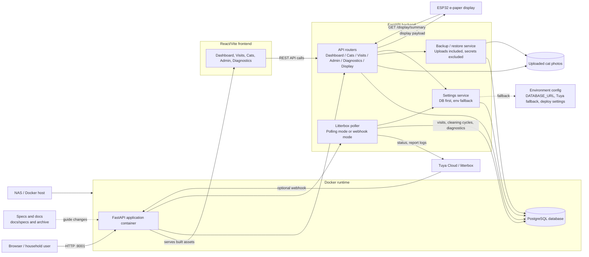

# Litterbox

A self-hosted health monitor for a Tuya-connected automatic litterbox. The app tracks cat visits, weights, cleaning cycles, poller health, and a small ESP32 e-paper status display.

The project is built for a real household setup: a FastAPI backend talks to the litterbox/Tuya data source, a React dashboard makes the data inspectable, PostgreSQL stores history, and optional ESP32 firmware renders a quiet always-on weight comparison view.

## What It Does

- Tracks litterbox visits, duration, weight, and cat assignment.
- Identifies cats by weight against per-cat reference weights.
- Shows dashboard summaries for today, recent visits, and weight over time.
- Supports manual cats and visit operations such as reassign/delete.
- Exposes `/display/summary` for a 400x300 ESP32 e-paper display.
- Records diagnostics for visit duration evidence and poller reconciliation.
- Keeps active implementation plans in numbered specs under `docs/specs/`, with built specs archived under `docs/specs/archive/`.

## Project Layout

| Path | Purpose |
|---|---|
| `app/` | FastAPI backend, routers, models, poller, Tuya integration logic |
| `frontend/` | React/Vite web UI |
| `firmware/epaper-display/` | PlatformIO ESP32 e-paper firmware |
| `tests/` | Backend pytest suite |
| `docs/specs/` | Active numbered implementation specs |
| `docs/specs/archive/` | Built implementation specs |
| `docs/IMPROVEMENT_SPECIFICATIONS.md` | Spec index |
| `AGENTS.md` / `docs/AGENTS.md` | Agent bootstrap and project working guidelines |
| `alembic/` | Database migrations |
| `docker-compose.yml` | App + PostgreSQL runtime stack |

## Runtime Stack

- Backend: FastAPI, SQLAlchemy, Alembic, PostgreSQL
- Frontend: React, Vite, Recharts, Vitest
- Device integration: Tuya polling/webhook support
- Firmware: ESP32 DevKit + Waveshare/Pico 4.2 inch black/white/red e-paper display

## Architecture



The backend is the integration hub: it serves the built React app, exposes the REST API, owns database access, and runs the Tuya poller in the selected update mode. Tuya credentials can now be managed from Admin through `app_settings`; environment variables remain a fallback for first boot and deployment continuity.

Backups package the database export and uploaded cat photos. Secret `app_settings` rows are intentionally excluded, so Tuya API keys/secrets must be re-entered through Admin or provided by environment fallback after a restore.

## Quick Start

Create local environment config:

```bash
cp .env.example .env
```

Set at minimum:

```bash
POSTGRES_PASSWORD=...
DATABASE_URL=postgresql://litterbox:<password>@localhost:5432/litterbox
TUYA_DEVICE_ID=...
TUYA_DEVICE_IP=...
TUYA_API_KEY=...
TUYA_API_SECRET=...
TUYA_API_REGION=...
```

Start the Docker stack:

```bash
docker compose up --build
```

The app is exposed on:

```text
http://localhost:8001
```

## Development

Backend setup:

```bash
python3 -m venv .venv
.venv/bin/python -m ensurepip --upgrade
.venv/bin/python -m pip install -r requirements.txt
```

Run backend tests:

```bash
.venv/bin/python -m pytest tests/ -q
```

Frontend setup:

```bash
cd frontend
npm ci
npm run dev
```

Frontend checks:

```bash
npm run lint
npm test
npm run build
```

Run the same validation path used by deploy:

```bash
./deploy.sh validate
```

## Deployment

`deploy.sh` validates backend and frontend before deploying. By default it deploys to the NAS configured in the script:

```bash
./deploy.sh
```

Useful environment overrides:

```bash
NAS_USER=selmer
NAS_HOST=192.168.68.115
NAS_PATH=/volume2/docker/litterbox
ALLOW_DIRTY_DEPLOY=false
APP_TIMEZONE=Europe/Amsterdam
```

The script refuses to deploy with local uncommitted changes unless `ALLOW_DIRTY_DEPLOY=true` is set.


## API Documentation

FastAPI exposes interactive API documentation automatically when the app is running:

```text
http://localhost:8001/docs        Swagger UI
http://localhost:8001/redoc       ReDoc
http://localhost:8001/openapi.json OpenAPI JSON
```

On the NAS, replace `localhost` with the NAS host, for example `http://192.168.68.115:8001/docs`.

## ESP32 E-Paper Display

Firmware lives in `firmware/epaper-display/`. It connects to Wi-Fi, fetches:

```text
GET /display/summary
```

and renders a minimal weight-comparison view:

- visits today
- latest weight
- weight around one month ago
- weight around three months ago

Configure local firmware secrets by copying:

```bash
cp firmware/epaper-display/include/config.example.h firmware/epaper-display/include/config.h
```

Build/upload with PlatformIO:

```bash
cd firmware/epaper-display
~/.platformio/penv/bin/pio run
~/.platformio/penv/bin/pio run --target upload
```

## Specifications

The project is intentionally spec-driven. New features should get a numbered spec before implementation. Active specs live in `docs/specs/`; once built and verified, move them to `docs/specs/archive/` as cleanup.

Start here:

- `AGENTS.md` — root bootstrap for agent instructions
- `docs/AGENTS.md` — project working guidelines for Codex and future automation
- `docs/IMPROVEMENT_SPECIFICATIONS.md` — index of all specs
- `docs/specs/` — active implementation-ready specs
- `docs/specs/archive/` — built specs
- `docs/SPECIFICATION.md` — broader codebase specification
- `docs/update-modes.md` — polling and webhook setup

Active implementation planning belongs in `docs/specs/`; ad-hoc planning folders are intentionally not used.

## Testing Notes

Backend tests use an in-memory SQLite database and mock Tuya cloud behavior, so no real litterbox credentials are needed for the normal test suite.

Test coverage includes:

- cat identification logic
- cats, visits, cleaning cycles, dashboard, and display APIs
- poller visit lifecycle and Tuya report-log reconciliation
- frontend pages/components with Vitest

Real Tuya end-to-end behavior still depends on live credentials and hardware.

## Operational Notes

- `DATABASE_URL` is required; the backend refuses to start without it.
- `UPDATE_MODE=polling` is the default. Webhook mode is documented in `docs/update-modes.md`.
- Adaptive visit polling is available behind `ADAPTIVE_VISIT_POLLING=true`; it is bounded by per-visit max seconds, daily budget, and cooldown settings.
- The e-paper display refresh interval is currently one hour by default.
- Weight history and display output depend on data quality; suspicious records should be corrected or marked ignored once those workflows are implemented.
